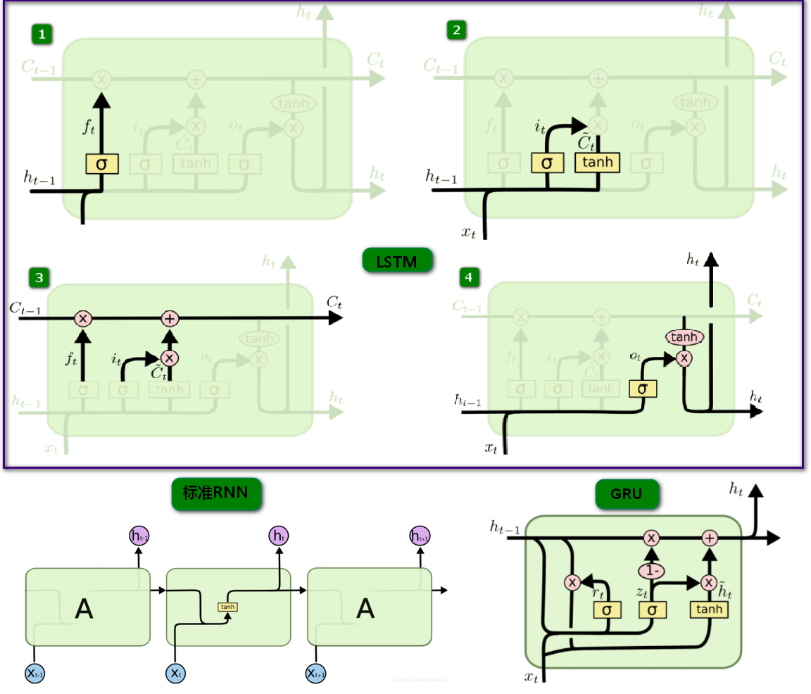
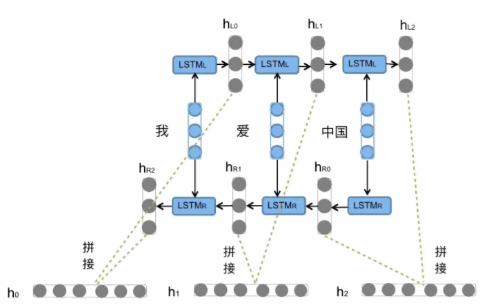

#### 标准RNN
标准的RNN结构中只有一个神经元，一个`tanh`层进行重复的学习，这样会存在一些弊端。例如，在比较长的环境中，例如在`I grew up in France… I speak fluent French`中去预测最后的`French`，那么模型会推荐一种语言的名字，但是预测具体是哪一种语言时就需要用到很远以前的`Franch`，这就说明在长环境中相关的信息和预测的词之间的间隔可以是非常长的。在理论上，RNN 绝对可以处理这样的长环境问题。人们可以仔细挑选参数来解决这类问题中的最初级形式，但在实践中，RNN 并不能够成功学习到这些知识。然而，LSTM模型就可以解决这一问题。
##### nn.RNNCell
>$h' = \tanh(w_{ih} x + b_{ih}  +  w_{hh} h + b_{hh})$

**Example:**
```python
rnn = nn.RNNCell(10, 20)
input = torch.randn(6, 3, 10)
hx = torch.randn(3, 20)
output = []
for i in range(6):
    hx = rnn(input[i], hx)
    output.append(hx)
```


#### LSTM
LSTM模型是由t时刻的输入词$X_t$，细胞状态$C_t$，临时细胞状态$\widetilde C_t$，隐层状态$h_t$，遗忘门$f_t$，记忆门$i_t$，输出门$O_t$组成。LSTM的计算过程可以概括为，通过对细胞状态中信息遗忘和记忆新的信息使得对后续时刻计算有用的信息得以传递，而无用的信息被丢弃，并在每个时间步都会输出隐层状态$h_t$，其中遗忘，记忆与输出由通过上个时刻的隐层状态$h_{t-1}$和当前输入$X_t$计算出来的遗忘门$f_t$，记忆门$i_t$，输出门$O_t$来控制。


* 1.丢弃信息   
$f_{ t } = \sigma \left( W_{f} \cdot \left[ h _ { t - 1 } , x _ { t } \right] + b _ { f } \right)$  

* 2.确定更新信息  
$i _ { t } = \sigma \left( W _ { i } \cdot \left[ h _ { t - 1 } , x _ { t } \right] + b _ { i } \right)$   
$\tilde { C } _ { t } = \tanh \left( W _ { C } \cdot \left[ h _ { t - 1 } , x _ { t } \right] + b _ { C } \right)$

* 3.更新细胞状态   
$C_{ t } = f_ { t } * C _ { t - 1 } + i _ { t } * \tilde { C } _ { t }$

* 4.输出信息   
$o _ { t } = \sigma \left( W _ { o } \left[ h _ { t - 1 } , x _ { t } \right] + b _ { o } \right)$   
$h _ { t } = o _ { t } * \tanh \left( C _ { t } \right)$
##### torch.nn.LSTM

* 参数:
    - **input_size**:  输入数据'x'的特征数
    - **hidden_size**: 输出`h` 的特征数 
    - **num_layers**: Number of recurrent layers. E.g., setting ``num_layers=2``
        would mean stacking two LSTMs together to form a `stacked LSTM`,
        with the second LSTM taking in outputs of the first LSTM and
        computing the final results. Default: 1
    - **bias**: 为False时无bias偏置项,Default: True
    - **batch_first**: 为True时，输入的表达方式为(batch_size,序列长度,特征数目)，Default: False
    - **dropout**: 不为0时会在每层LSTM(最后1层除外)添加droupout层，Default: 0
    - **bidirectional**: 为True时变为双向LSTM, Default:False
* 输入:input, (h_0, c_0)
  - **input** of shape `(seq_len, batch, input_size)`: tensor containing the features
    of the input sequence.
    The input can also be a packed variable length sequence.
    See :func:`torch.nn.utils.rnn.pack_padded_sequence` or
    :func:`torch.nn.utils.rnn.pack_sequence` for details.
  - **h_0** of shape `(num_layers * num_directions, batch, hidden_size)`: tensor
    containing the initial hidden state for each element in the batch.
    If the RNN is bidirectional, num_directions should be 2, else it should be 1.
  - **c_0** of shape `(num_layers * num_directions, batch, hidden_size)`: tensor
    containing the initial cell state for each element in the batch.
    If `(h_0, c_0)` is not provided, both **h_0** and **c_0** default to zero.
* 输出: output, (h_n, c_n)
    - **output** of shape `(seq_len, batch, num_directions * hidden_size)`: tensor
      containing the output features `(h_t)` from the last layer of the LSTM,
      for each t. If a :class:`torch.nn.utils.rnn.PackedSequence` has been
      given as the input, the output will also be a packed sequence.

      For the unpacked case, the directions can be separated
      using ``output.view(seq_len, batch, num_directions, hidden_size)``,
      with forward and backward being direction `0` and `1` respectively.
      Similarly, the directions can be separated in the packed case.
    - **h_n** of shape `(num_layers * num_directions, batch, hidden_size)`: tensor
      containing the hidden state for `t = seq_len`.

      Like *output*, the layers can be separated using
      ``h_n.view(num_layers, num_directions, batch, hidden_size)`` and similarly for *c_n*.
    - **c_n** (num_layers * num_directions, batch, hidden_size): tensor
      containing the cell state for `t = seq_len`

##### torch.nn.LSTMCell
LSTMCell为单个LSTM单元,每次输入的序列长度为1,对于length>1的序列需要自己迭代。
双向LSTM也需要自己搭建，灵活性较高。
*   参数:
    - input_size: The number of expected features in the input `x`
    - hidden_size: The number of features in the hidden state `h`
    - bias: If `False`, then the layer does not use bias weights `b_ih` and
            `b_hh`. Default: ``True``

*   输入: input, (h_0, c_0)
      - **input** of shape `(batch, input_size)`: tensor containing input features
      - **h_0** of shape `(batch, hidden_size)`: tensor containing the initial hidden
        state for each element in the batch.
      - **c_0** of shape `(batch, hidden_size)`: tensor containing the initial cell state
        for each element in the batch.
        If `(h_0, c_0)` is not provided, both **h_0** and **c_0** default to zero.

*   输出: h_1, c_1
      - **h_1** of shape `(batch, hidden_size)`: tensor containing the next hidden state
        for each element in the batch
      - **c_1** of shape `(batch, hidden_size)`: tensor containing the next cell state
        for each element in the batch


```python
#input_size,hidden_size
rnn = nn.LSTMCell(10, 20)
#seq_len,batch,input_size,注意第6指的是序列长度
input = torch.randn(6, 3, 10)
hx = torch.randn(3, 20)
cx = torch.randn(3, 20)
output = []
#序列迭代
for i in range(6):
    hx, cx = rnn(input[i], (hx, cx))
    output.append(hx)
```

#### GRU

GRU作为LSTM的一种变体，将忘记门和输入门合成了一个单一的更新门。   
同样还混合了细胞状态和隐藏状态，加诸其他一些改动。   
最终的模型比标准的 LSTM 模型要简单，也是非常流行的变体。  

$z _ { t } = \sigma \left( W _ { z } \cdot \left[ h _ { t - 1 } , x _ { t } \right] \right)$

$r _ { t } = \sigma \left( W _ { r } \cdot \left[ h _ { t - 1 } , x _ { t } \right] \right)$

$\tilde { h } _ { t } = \tanh \left( W \cdot \left[ r _ { t } * h _ { t - 1 } , x _ { t } \right] \right)$
 
$h _ { t } = \left( 1 - z _ { t } \right) * h _ { t - 1 } + z _ { t } * \tilde { h } _ { t }$

#### 双向LSTM

前向的LSTM与后向的LSTM结合成BiLSTM。比如，我们对`我爱中国`这句话进行编码，如上图所示。    
前向的$LSTM_L$依次输入`我`|`爱`|`中国`得到三个向量{$H_{L0},H_{L1},H_{L2}$}。后向的$LSTM_R$依次输入`中国`|`爱`|`我`得到三个向量{$H_{R0},H_{R1},H_{R2}$}。     
最后将前向和后向的隐向量进行拼接得到{$[H_{L0},H_{R0}], [H_{L1},H_{R1}], [H_{L2},H_{R2}]$}，即{$h_0,h_1,h_2$}。   
对于情感分类任务来说，我们采用的句子的表示往往是$[H_{L2},H_{R2}]$。因为其包含了前向与后向的所有信息
#### 总结
* 标准LSTM和GRU的差别并不大，但是都比tanh要明显好很多，所以在选择标准LSTM或者GRU的时候还要看具体的任务是什么。 
使用LSTM的原因之一是解决RNN Deep Network的Gradient错误累积太多，以至于Gradient归零或者成为无穷大，所以无法继续进行优化的问题。GRU的构造更简单：比LSTM少一个gate，这样就少几个矩阵乘法。在训练数据很大的情况下GRU能节省很多时间。

* LSTM通过门的控制，可以有效的防止梯度消失，但是依旧可能出现梯度爆炸的问题，所以训练LSTM会加入梯度裁剪（Gradient Clipping）。在Pytorch中梯度裁剪可以使用
`nn.utils.clip_grad_norm(filter(lambda p:p.requires_grad,model.parameters()),max_norm=max_norm)`