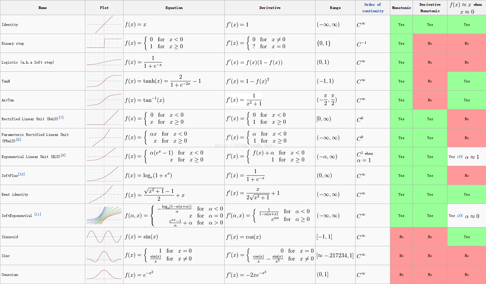

### nn.detach
返回新的tensor,与原来的tensor共享数据，但是requires_grad=False


### 杀死进程
```bash
ps aux|grep lee|grep python3|awk '{print $2}'|xargs kill
```


### nn.Sigmod
针对单个Tensor的映射(用于二分类))
```python
input = torch.randn(2, 3)
#tensor([[ 1.9144, -1.9266,  0.8993],[-0.0207, -1.1922, -0.6528]])

s=nn.Sigmod()
s(input)
#tensor([[ 0.8715,  0.1271,  0.7108],[ 0.4948,  0.2329,  0.3424]])

```

### nn.PReLU(lower,upper,inplace)
>参数:    
>lower: lower bound of the uniform distribution. Default: $\frac{1}{8}$   
upper: upper bound of the uniform distribution. Default: $\frac{1}{3}$   
inplace: can optionally do the operation in-place. Default: ``False``


### nn.smooth_l1_loss:平滑平均绝对误差|HuberLoss
分段函数，等价于`nn.SmoothL1Loss`，在(-1,1)上是L2损失，其他是L1损失
优点:可微，相当于L2对异常值不敏感，当误差很小的时候为L2，当误差很大时为L1

>$$ \text{loss}(x, y) = \frac{1}{n} \sum_{i} z_{i} $$
>$$z_{i} =
  \begin{cases}
  0.5*(x_i - y_i)^2, & \text{if } |x_i - y_i| < 1 \\
  |x_i - y_i| - 0.5, & \text{otherwise }
  \end{cases}$$


### nn.MSELoss:均方误差|L2损失
L2Loss在异常点误差较大时会放大误差，使得损失值远大于L1Loss,导致模型整体表现下降

```python
Args:
size_average (bool, optional): By default, the losses are averaged
    over observations for each minibatch. However, if the field
    size_average is set to ``False``, the losses are instead summed for
    each minibatch. Only applies when reduce is ``True``. Default: ``True``
reduce (bool, optional): By default, the losses are averaged
    over observations for each minibatch, or summed, depending on
    size_average. When reduce is ``False``, returns a loss per input/target
    element instead and ignores size_average. Default: ``True``
```

$$\ell(x, y) = L = \{l_1,\dots,l_N\}^\top$$
$$l_n = \left( x_n - y_n \right)^2$$


where $N$ is the batch size. If reduce is ``True``, then:


$$\ell(x, y) = 
    \begin{cases}
    \operatorname{mean}(L), & \text{if}\; \text{size-average} = \text{True},\\
    \operatorname{sum}(L),  & \text{if}\; \text{size-average} = \text{False}.
    \end{cases}$$


### nn.L1Loss:平均绝对误差|L1损失


```python
size_average (bool, optional): By default, the losses are averaged
    over observations for each minibatch. However, if the field
    size_average is set to ``False``, the losses are instead summed for
    each minibatch. Ignored when reduce is ``False``. Default: ``True``
reduce (bool, optional): By default, the losses are averaged or summed
    for each minibatch. When reduce is ``False``, the loss function returns
    a loss per input/target element instead and ignores size_average.
    Default: ``True``
```

$$\ell(x, y) = L = \{l_1,\dots,l_N\}^\top, \quad
    l_n = \left| x_n - y_n \right|$$

where $N$ is the batch size. If reduce is ``True``, then:

$$
    \ell(x, y) = \begin{cases}
        \operatorname{mean}(L), & \text{if}\; \text{size-average} = \text{True},\\
        \operatorname{sum}(L),  & \text{if}\; \text{size-average} = \text{False}.
    \end{cases}$$

`x` and `y` arbitrary shapes with a total of `n` elements each.

The sum operation still operates over all the elements, and divides by `n`.

The division by `n` can be avoided if one sets the constructor argument
`size_average=False`.