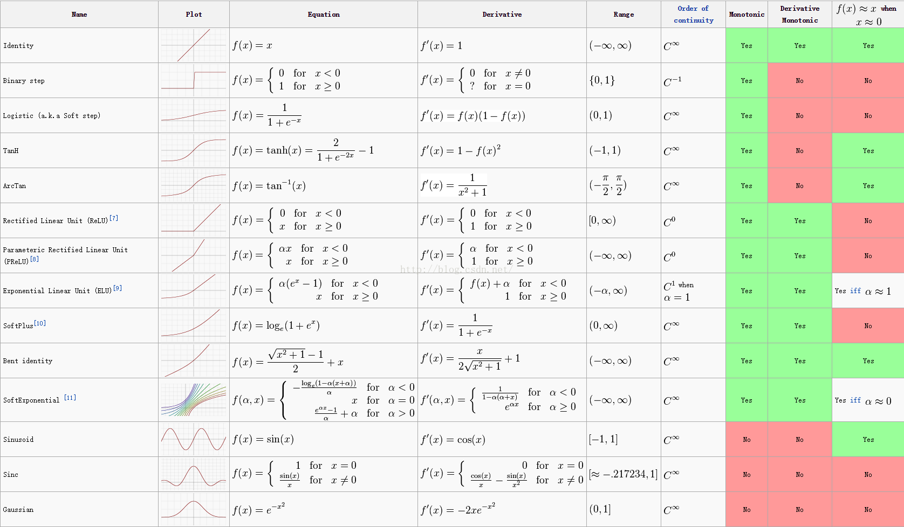

### nn.Relu
>inplace=True时直接替换输入作为输出,可以稍微降低内存.  
但是有时候无法使用,因为输入可能会被释放,如报错需改成False
```python
nn.Relu(inplace=True)
```


### nn.Softmax
针对多个Tensor的归一化(用于多分类))
```python
input = torch.randn(2, 3)
#tensor([[ 1.9144, -1.9266,  0.8993],[-0.0207, -1.1922, -0.6528]])
m = nn.Softmax(0) #每列之和为1
output = m(input)
#tensor([[ 0.8738,  0.3242,  0.8252],[ 0.1262,  0.6758,  0.1748]])

m = nn.Softmax(1) #每行之和为1
output = m(input)
#tensor([[ 0.7226,  0.0155,  0.2619],[ 0.5431,  0.1683,  0.2886]])

```

### nn.LogSoftmax
等于log(nn.Softmax),与`nn.Softmax`不同点:在log域,loss惩罚会增大,    
例如log(0.9)-log(0.1)=-0.10536051565782628+2.3025850929940455=2.197224577336219,    
即在log域二者的loss惩罚相差将近2.197224577336219/(0.9-0.1)=2.76 53倍,pytorch的CrossEntropyLoss也内置LogSoftmax

```python
input = torch.randn(2, 3)
#tensor([[ 1.9144, -1.9266,  0.8993],[-0.0207, -1.1922, -0.6528]])
m = nn.Softmax(0) #每列之和为1
output = m(input)
#tensor([[ 0.8738,  0.3242,  0.8252],[ 0.1262,  0.6758,  0.1748]])

m = nn.Softmax(1) #每行之和为1
output = m(input)
#tensor([[ 0.7226,  0.0155,  0.2619],[ 0.5431,  0.1683,  0.2886]])

```


### nn.Sigmod
针对单个Tensor的映射(用于二分类))
```python
input = torch.randn(2, 3)
#tensor([[ 1.9144, -1.9266,  0.8993],[-0.0207, -1.1922, -0.6528]])

s=nn.Sigmod()
s(input)
#tensor([[ 0.8715,  0.1271,  0.7108],[ 0.4948,  0.2329,  0.3424]])

```

### nn.PReLU(lower,upper,inplace)
>参数:    
>lower: lower bound of the uniform distribution. Default: $\frac{1}{8}$   
upper: upper bound of the uniform distribution. Default: $\frac{1}{3}$   
inplace: can optionally do the operation in-place. Default: ``False``


### nn.smooth_l1_loss:平滑平均绝对误差|HuberLoss
分段函数，等价于`nn.SmoothL1Loss`，在(-1,1)上是L2损失，其他是L1损失
优点:可微，相当于L2对异常值不敏感，当误差很小的时候为L2，当误差很大时为L1

>$$ \text{loss}(x, y) = \frac{1}{n} \sum_{i} z_{i} $$
>$$z_{i} =
  \begin{cases}
  0.5*(x_i - y_i)^2, & \text{if } |x_i - y_i| < 1 \\
  |x_i - y_i| - 0.5, & \text{otherwise }
  \end{cases}$$


### nn.MSELoss:均方误差|L2损失
L2Loss在异常点误差较大时会放大误差，使得损失值远大于L1Loss,导致模型整体表现下降

```python
Args:
size_average (bool, optional): By default, the losses are averaged
    over observations for each minibatch. However, if the field
    size_average is set to ``False``, the losses are instead summed for
    each minibatch. Only applies when reduce is ``True``. Default: ``True``
reduce (bool, optional): By default, the losses are averaged
    over observations for each minibatch, or summed, depending on
    size_average. When reduce is ``False``, returns a loss per input/target
    element instead and ignores size_average. Default: ``True``
```

$$\ell(x, y) = L = \{l_1,\dots,l_N\}^\top$$
$$l_n = \left( x_n - y_n \right)^2$$


where $N$ is the batch size. If reduce is ``True``, then:


$$\ell(x, y) = 
    \begin{cases}
    \operatorname{mean}(L), & \text{if}\; \text{size-average} = \text{True},\\
    \operatorname{sum}(L),  & \text{if}\; \text{size-average} = \text{False}.
    \end{cases}$$


### nn.L1Loss:平均绝对误差|L1损失


```python
size_average (bool, optional): By default, the losses are averaged
    over observations for each minibatch. However, if the field
    size_average is set to ``False``, the losses are instead summed for
    each minibatch. Ignored when reduce is ``False``. Default: ``True``
reduce (bool, optional): By default, the losses are averaged or summed
    for each minibatch. When reduce is ``False``, the loss function returns
    a loss per input/target element instead and ignores size_average.
    Default: ``True``
```

$$\ell(x, y) = L = \{l_1,\dots,l_N\}^\top, \quad
    l_n = \left| x_n - y_n \right|$$

where $N$ is the batch size. If reduce is ``True``, then:

$$
    \ell(x, y) = \begin{cases}
        \operatorname{mean}(L), & \text{if}\; \text{size-average} = \text{True},\\
        \operatorname{sum}(L),  & \text{if}\; \text{size-average} = \text{False}.
    \end{cases}
$$

`x` and `y` arbitrary shapes with a total of `n` elements each.

The sum operation still operates over all the elements, and divides by `n`.

The division by `n` can be avoided if one sets the constructor argument
`size_average=False`.


### nn.BCELoss:二分类交叉熵
用的时候需要在前面加上Sigmod,保证分类概率位于[0,1]
```python
    Args:
        weight (Tensor, optional): a manual rescaling weight given to the loss
            of each batch element. If given, has to be a Tensor of size
            "nbatch".
        size_average (bool, optional): Deprecated (see :attr:`reduction`). By default,
            the losses are averaged over each loss element in the batch. Note that for
            some losses, there multiple elements per sample. If the field :attr:`size_average`
            is set to ``False``, the losses are instead summed for each minibatch. Ignored
            when reduce is ``False``. Default: ``True``
        reduce (bool, optional): Deprecated (see :attr:`reduction`). By default, the
            losses are averaged or summed over observations for each minibatch depending
            on :attr:`size_average`. When :attr:`reduce` is ``False``, returns a loss per
            batch element instead and ignores :attr:`size_average`. Default: ``True``
        reduction (string, optional): Specifies the reduction to apply to the output:
            'none' | 'elementwise_mean' | 'sum'. 'none': no reduction will be applied,
            'elementwise_mean': the sum of the output will be divided by the number of
            elements in the output, 'sum': the output will be summed. Note: :attr:`size_average`
            and :attr:`reduce` are in the process of being deprecated, and in the meantime,
            specifying either of those two args will override :attr:`reduction`. Default: 'elementwise_mean'
```
公式：

$$
\ell(x, y) = L = \{l_1,\dots,l_N\}^\top  \\
l_n = - w_n \left[ y_n \cdot \log x_n + (1 - y_n) \cdot \log (1 - x_n) \right]
$$


where :math:`N` is the batch size. If reduce is ``True``, then

$$ \ell(x, y) = \begin{cases}
    \operatorname{mean}(L), & \text{if}\; \text{size-average} = \text{True},\\
    \operatorname{sum}(L),  & \text{if}\; \text{size-average} = \text{False}.
    \end{cases} 
$$