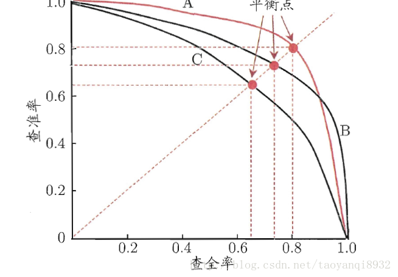
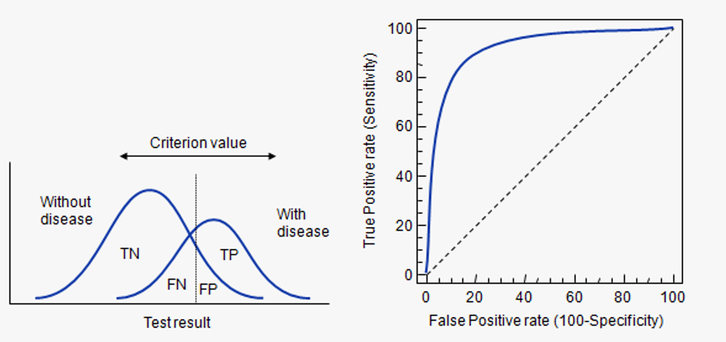

#### TP/FP/TN/FN
>T/N/P/N:True/False/Positive/Negative,记忆方法,例如TN,T*N=负样本，后面的N代表预测值为负，
故为 副样本>预测为负

* TP:正样本>预测为正
* FP:负样本>预测为正
* TN:负样本>预测为负
* FN:正样本>预测为负

#### PR曲线：

PR曲线(Precision-Recall),X轴：召回率(查全率)) Y轴：准确率(差准率) 
Precision:准确率，TP/(TP+FP),表示所有预测为正的结果中样本值也为正的比例，主体是预测值(宁缺勿滥)  
Recall:召回率,TP/(TP+FN)，所有正样本被预测为正的比例，主体是样本值(宁可错杀一千，不可放过一个)  

如果一个学习器的P-R曲线被另一个学习器的P-R曲线完全包住，则可断言后者的性能优于前者，例如上面的A和B优于学习器C，但是A和B的性能无法直接判断，   
但我们往往仍希望把学习器A和学习器B进行一个比较，我们可以根据曲线下方的面积大小来进行比较，但更常用的是平衡点或者是F1值。   
平衡点（BEP）是查准率=查全率时的取值，如果这个值较大，则说明学习器的性能较好。而F1 = 2 * P * R ／( P + R )，同样，F1值越大，   
我们可以认为该学习器的性能较好   

#### ROC曲线:

ROC(Receuver Characterristic Curvve),受试者工作特征曲线，又称感受性曲线,  
优点：当测试集中的正负样本的分布变化的时候（例如负样本远多余正样本）,能够保持不变。   
ROC：X轴：FPR  Y轴：TPR，  
AUC(Area Under Curve)表示ROC曲线的面积,小于1
