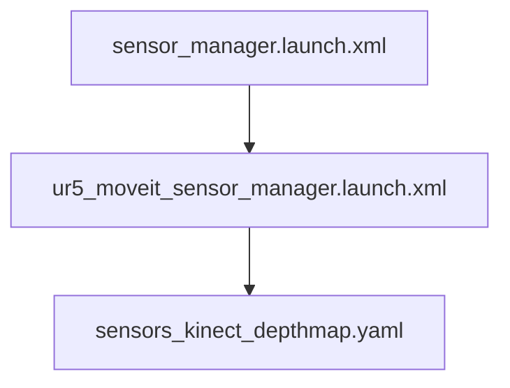

#### 层次结构




#### 参数配置
```yaml
# sensors_kinect_depthmap.yaml
sensors:
  - sensor_plugin: occupancy_map_monitor/DepthImageOctomapUpdater
    image_topic: /camera/depth/image_rect_raw  #/head_mount_kinect/depth_registered/image_raw 
    queue_size: 5
    near_clipping_plane_distance: 0.1   #0.3
    far_clipping_plane_distance:  2.0    #5.0
    shadow_threshold: 0.3
    padding_scale: 2.0
    padding_offset: 0.03
    # filtered_cloud_topic: filtered_clouds
```

* sensor_manager

```xml
<!-- ur5_moveit_sensor_manager.launch.xml -->
<launch>
 <rosparam file="$(find ur5_moveit_config)/config/sensors_kinect_depthmap.yaml"/>
</launch>
```

```xml
<!-- sensor_manager.launch.xml -->
<launch>
  <!-- This file makes it easy to include the settings for sensor managers -->  

  <!-- Params for the octomap monitor -->
  <!--  <param name="octomap_frame" type="string" value="some frame in which the robot moves" /> -->
  <param name="octomap_resolution" type="double" value="0.05" />
  <param name="max_range" type="double" value="5.0" />

  <!-- Load the robot specific sensor manager; this sets the moveit_sensor_manager ROS parameter -->
  <arg name="moveit_sensor_manager" default="ur5" />
  <include file="$(find ur5_moveit_config)/launch/$(arg moveit_sensor_manager)_moveit_sensor_manager.launch.xml" />
  
</launch>

```